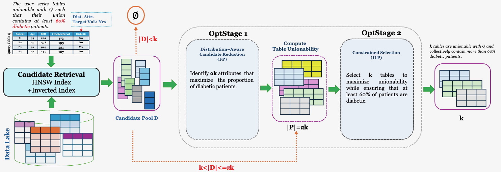

# DUTS — Distribution-Aware Unionable Table Search

Code for *Distribution-Aware Unionable Table Search* (Besat Kassaie and Renée J. Miller, EDBT 2027).

## About

Unionable table search finds data-lake tables that can be unioned with a query table to add more
tuples. Many uses also need the combined data to have a particular distribution — for example, a
target class balance in a training set, or enough representation of a demographic group. A set of
highly unionable tables can fail that requirement even when every table looks reasonable on its own,
because what matters is the distribution of their union with the query.

**Distribution-Aware Unionable Table Search (DUTS)**: given a query table, a categorical
*distribution attribute* `d` of it, a set of target values `V` and a minimum proportion `τ`, find
`k` data-lake tables that maximize unionability with the query such that, in the union of the query
and the `k` tables, at least a fraction `τ` of the tuples have a `d`-value in `V`. The problem is
NP-hard.

The paper compares two approaches:

- **DUTS-2OptS (distribution-first)** — retrieve candidate attributes that are semantically similar
  to `d` (HNSW over attribute embeddings) and contain a target value (inverted index); **OptStage 1**
  picks a pool of `α·k` candidates that maximizes the achievable proportion, solved exactly as a 0–1
  fractional program with Dinkelbach's method; unionability is computed for that pool only;
  **OptStage 2** picks the final `k` tables maximizing unionability subject to the proportion
  constraint, an exact 0–1 integer linear program.
- **Swap-based repair (unionability-first)** — take the most unionable tables from a standard search
  (Starmie) and greedily swap tables to satisfy the constraint (Greedy-Swap), optionally pruning
  dominated candidates first (Preference-Swap).

Across the benchmarks, the distribution-first approach finds feasible results for more queries while
keeping high unionability, and scales to data lakes with a million tables.



*Overview of the DUTS-2OptS pipeline. Candidate processing progresses from attribute-level retrieval
and OptStage 1 to table-level unionability computation and OptStage 2.*

## Repository layout

`duts/` is the two-stage optimization core (OptStage 1: Dinkelbach pool selection; OptStage 2:
exact 0–1 ILP via HiGHS), `dutsx/` the retrieval / synopsis / unionability adapters, `starmie_fair/`
the Starmie extensions the baselines and synopses use, `experiments/` the experiment harness, and
`main.py` the single entry point for running experiments.

## Setup

```bash
git clone -b EDBT27 https://github.com/Besatkassaie/DUTS.git && cd DUTS
```

All commands below run from this directory.

### 1. Python environment

```bash
conda create -y -n duts --override-channels -c conda-forge python=3.8.5 pip zstd
conda activate duts
pip install -r requirements.txt          # pinned versions the reported results were produced with
```

`--override-channels -c conda-forge` avoids Anaconda's `defaults` channel, which recent conda
refuses to use until its Terms of Service are accepted (`CondaToSNonInteractiveError`). `zstd` is
needed to extract the benchmark archives. (`conda env create -f environment.yml` is equivalent where
the `defaults` channel is not configured.)

`requirements.txt` installs the CUDA 12.1 build of PyTorch. **No GPU?** Install the CPU build first;
the pinned `torch==2.4.1` is then already satisfied and pip keeps it:

```bash
pip install torch==2.4.1 --index-url https://download.pytorch.org/whl/cpu
pip install -r requirements.txt
```

PyTorch (and `transformers`, `tokenizers`, `scikit-learn`, `mlflow`, `xgboost`) is only needed to
*generate* embeddings. If you use precomputed embeddings, the core block of `requirements.txt`
(numpy, scipy, pandas, hnswlib, networkx, munkres) is enough to run DUTS and the baselines.

### 2. Starmie code

The fairness-aware Starmie modules DUTS needs — the value-distribution synopsis format
(`TableMetadata.py`), the Starmie search with distribution-attribute alignment, and the swap-based
baselines — are bundled in `starmie_fair/` (see `starmie_fair/README.md`). Nothing else is needed to
run DUTS and the baselines.

Only to **regenerate embeddings** (the benchmarks ship them) you also need Starmie's model code
(`sdd/`) from the public repository:

```bash
git clone https://github.com/megagonlabs/starmie.git /path/to/starmie   # then pass --starmie-root /path/to/starmie
```

### 3. Benchmarks

All benchmarks of the paper's Table 2 — with their query lists, ground truth, precomputed
embeddings and value-distribution synopses — are on Zenodo:
**https://zenodo.org/records/23140306**

| Experiment | Benchmark (paper) | # Queries | # Tables | Zenodo archive(s) | Dataset name here |
|---|---|---:|---:|---|---|
| Effectiveness | Santo-Small | 48 | 999 | `santos3.tar.zst` | `santos3` |
| Effectiveness | TUS-Small | 92 | 9,178 | `tusSmall3.tar.zst.part*` | `tusSmall3` |
| Effectiveness | TUS-Large | 142 | 18,309 | `tusLarge3.tar.zst.part*` | `tusLarge3` |
| Scalability | Santos-Large | 46 | 11,086 | `santosLarge.tar.zst.part*` | `santosLarge` |
| Scalability | WDC-10K / 100K / 1M | 67 | 10K / 100K / 1M | `wdc_tiers.tar.zst`, `wdc_vectors.tar.zst.part*`, `wdc_indexes.tar.zst`, `wdc_queries.tar.zst` | — |

Download into the repository directory, then join, check and extract. For Table 3 (the three
effectiveness benchmarks, ~6.7 GB) these files are enough:

```bash
Z=https://zenodo.org/records/23140306/files
FILES="MD5SUMS santos3.tar.zst
       tusSmall3.tar.zst.part00 tusSmall3.tar.zst.part01 tusSmall3.tar.zst.part02
       tusLarge3.tar.zst.part00 tusLarge3.tar.zst.part01 tusLarge3.tar.zst.part02 tusLarge3.tar.zst.part03"
# Zenodo serves ~0.3 MB/s per connection, so download several files in parallel:
printf '%s\n' $FILES | xargs -P 6 -I{} wget -q -c -O {} "$Z/{}?download=1"

cat tusSmall3.tar.zst.part* > tusSmall3.tar.zst
cat tusLarge3.tar.zst.part* > tusLarge3.tar.zst
md5sum -c --ignore-missing MD5SUMS                   # expect "OK" for each of the three archives
for a in santos3 tusSmall3 tusLarge3; do tar --zstd -xf $a.tar.zst; done
# -> data/santos3/, data/tusSmall3/, data/tusLarge3/, data/protected_attributes_*.csv
```

The scalability data (`santosLarge.tar.zst.part00–02`, `wdc_*`, ~20 GB more, 15 GB of it WDC
embeddings) and the model checkpoint are downloaded the same way when needed; the whole record is
26.7 GB. (Don't download the record's `README.md` into the repository directory — it would overwrite
this file.) `md5sum --ignore-missing` silently skips archives that are absent, so check that every
archive you expect prints `OK`.

`main.py` runs the three effectiveness benchmarks (`santos3`, `tusSmall3`, `tusLarge3`). The
Santos-Large and WDC data (with the 46- and 67-query workloads) is provided for the scalability
experiments, which use the scripts under `experiments/` rather than `main.py`. The Zenodo record's
README describes every archive in detail.

Each dataset is a directory laid out as:

```
<dataset>/
├── datalake/*.csv                              # datalake tables
├── query/*.csv                                 # query tables
├── <dataset>_benchmark_groundtruth.csv         # or <dataset>_small_benchmark_groundtruth.csv
├── vectors/cl_{datalake,query}_drop_col_tfidf_entity_column_0.pkl   # embeddings (can be generated)
└── indexes/metadata_combined.pkl               # synopsis (can be generated)
```

plus a query list `protected_attributes.csv` inside it, or `protected_attributes_<dataset>.csv` next
to it, with columns `q_name, protected_attribute_id, protected_value`. If the datasets live in
`data/<dataset>`, the program suggests every path itself; extracted elsewhere, pass `--data-root`
(or set `DUTS_DATA_ROOT`).

### 4. Model checkpoint (only to generate embeddings)

The Starmie checkpoint that produced every embedding in the Zenodo archives is in the same record:
`starmie_santos_model_drop_col_tfidf_entity_column_0.pt` (fine-tuned on Santos). You need it only
to regenerate embeddings, since the archives already include them.

When embeddings are missing, the program asks for this file (or pass `--checkpoint`); placed in the
repository directory or in `data/`, it is suggested automatically.

## Running an experiment

```bash
python main.py
```

With no arguments the program asks for everything it needs and suggests a value in brackets for
each (Enter accepts it). Every parameter can also be passed on the command line; anything missing is
prompted for. `python main.py --help` lists all of them.

```bash
python main.py --system duts --dataset santos3 \
    --dataset-path data/santos3 \
    --index-path artifacts/santos3/index \
    --embedding-path data/santos3/vectors \
    --k 10 --alpha 5 --defaults
```

| | |
|---|---|
| `--system` | `duts`, `starmie` (top-k, no fairness), `starmie_exhaustive` (exhaustive swap), `starmie_nl` (NL swap) |
| `--dataset` | name, e.g. `santos3`, `tusSmall3`, `tusLarge3` |
| `--dataset-path` | directory with `datalake/` and `query/` (CSV tables) and the groundtruth CSV |
| `--index-path` | where the DUTS HNSW index (and, if built here, the synopsis) lives |
| `--embedding-path` | directory with `cl_datalake_…pkl` / `cl_query_…pkl` column embeddings |
| method parameters | `--k --f-star --delta --sigma`; DUTS: `--alpha --top-n --theta-cat`; baselines: `--n-columns --workers` |
| `--defaults` | use defaults for method parameters instead of prompting |
| `--non-interactive` | never prompt (fail on a missing required parameter) |
| `--limit-queries N` | first N queries only (smoke test) |
| `--data-root` | where the benchmark archives were extracted (default `data/`, or `$DUTS_DATA_ROOT`) |
| `--output-dir` | where result files go (default `experiments/results/main/`) |

Options used only when a prerequisite has to be built (asked for interactively otherwise):

| | |
|---|---|
| `--build-missing` | build missing prerequisites without asking for confirmation |
| `--checkpoint PATH` | trained Starmie model checkpoint (`.pt`) for generating embeddings |
| `--starmie-root PATH` | public Starmie checkout (its `sdd/` package) for generating embeddings |
| `--embed-batch-size N` | tables per inference batch when generating embeddings (default 1024; lower it if GPU memory runs out) |
| `--hnsw-m M` | HNSW graph degree for the DUTS index (default 32) |
| `--hnsw-ef-construction N` | HNSW build-time search width (default 200) |

**Baselines and `--workers`.** The paper's baseline numbers (Table 3) were produced with
`--workers 8`. Each worker builds its own Starmie HNSW index in memory, so memory grows with the
number of workers (the paper's runs used 8 workers with 128 GB RAM). Expect small run-to-run differences in the baselines — a few queries out of 48–142, mostly
ones that end infeasible — because the per-worker index builds, multi-threaded BLAS and Python's
per-run hash seed (iteration order of table-name sets, i.e. tie-breaking) are not pinned.

The query list (`protected_attributes.csv` in the dataset directory, or
`../protected_attributes_<dataset>.csv`), the groundtruth and the synopsis are located
automatically and can be overridden with `--protected-csv`, `--groundtruth-csv` and
`--metadata-path`.

### Prerequisites are checked first

Before anything runs, every required input and artifact is checked and listed:

* **Input data** (tables, query list, groundtruth) cannot be generated; a missing
  one stops the run with an explanation of what to supply.
* **Derived artifacts** are built on request, then you are asked to rerun (the exact command is
  printed):
  * column **embeddings** — Starmie model inference over every table (asks for the public Starmie
    code, `--starmie-root`, and a trained checkpoint, `--checkpoint`; uses a GPU when available);
  * the **value-distribution synopsis** (`metadata_combined.pkl`, one histogram per column);
  * the **DUTS HNSW index** (asks for `M` / `ef_construction`); an index built from different
    embeddings or synopsis is detected as stale and rebuilt.

Building asks for confirmation; `--build-missing` skips the question (and is required when running
non-interactively).

Exit codes: `0` done · `2` bad configuration · `3` prerequisites built, rerun · `4` a prerequisite
is missing and was not built · `130` interrupted.

### Walkthrough: a first run

A first DUTS run on santos3, with the benchmark extracted to `data/santos3` and no DUTS
index built yet (output shortened):

```text
$ python main.py --defaults
Enter a value, or press Enter to accept the [suggestion].
  system/method to run (duts/starmie/starmie_exhaustive/starmie_nl): duts
  dataset (benchmark) name, e.g. santos3, tusSmall3, ...: santos3
  dataset directory holding datalake/ and query/ [/path/to/DUTS/data/santos3]:
  index directory (DUTS HNSW index; metadata store if built here) [/path/to/DUTS/artifacts/santos3/index]:
  embedding directory holding the Starmie column-vector pickles [/path/to/DUTS/data/santos3/vectors]:

prerequisites
  [ok] bundled Starmie modules                      /path/to/DUTS/starmie_fair
  [ok] datalake tables                              .../santos3/datalake (999 CSV files)
  [ok] query tables                                 .../santos3/query (48 CSV files)
  [ok] query list (protected attributes)            .../protected_attributes_santos3.csv
  [ok] groundtruth                                  .../santos3_small_benchmark_groundtruth.csv
  [ok] column embeddings                            .../santos3/vectors/cl_datalake_...pkl + cl_query_...pkl
  [ok] value-distribution synopsis (MetadataStore)  .../santos3/indexes/metadata_combined.pkl
  [--] DUTS HNSW index                              missing: .../artifacts/santos3/index/santos3_duts_hnsw_m32_tc50_sig06.bin

The following prerequisites must be built before duts can run:
  - DUTS HNSW index: missing: ...
The DUTS HNSW index needs:
  HNSW graph degree M [32]:
  HNSW ef_construction [200]:

Build them now? [Y/n]
building HNSW (M=32, ef_construction=200) over 999 tables ...

Prerequisites are ready. Rerun the experiment with:
  python main.py --system duts --dataset santos3 --dataset-path ... --k 10 ... --output-dir ...
```

The program exits with code 3. Run the printed command; it has every parameter filled in, so it
does not prompt again:

```text
$ python main.py --system duts --dataset santos3 --dataset-path ... --output-dir ...
...
running duts on santos3 ...
setup 2.2s: 999 datalake tables indexed, 48 queries (48 skipped)

========================================================================
RESULTS  system=duts  dataset=santos3
========================================================================
  parameters        k=10  f_star=0.4  delta=0.1  sigma=0.6  alpha=5.0  top_n=1000  theta_cat=50  (tau=0.300)
  queries           48 evaluated, 48 skipped (not in query dir / no embedding)
  feasible          39 / 48  (81.2%)
    infeasible: insufficient_candidates      7
    infeasible: stage2_infeasible            2
  precision         0.8104   (mean over all queries; infeasible = 0)
  recall            0.3005   (ideal recall@k = 0.4736)
  ...
  avg per query     0.0260s

========================================================================
EXECUTION ENVIRONMENT
========================================================================
  python            3.8.5 ...
```

"48 skipped" is expected on santos3: the query list also names the 48 non-fair originals of the
queries, which are not in `query/`.

If embeddings or the synopsis are missing too, all of them are built in the same step: embeddings
first (you are asked for the checkpoint), then the synopsis, then the index. Embedding generation
is the slow part on large datasets; the rest takes seconds to minutes.

**Non-interactive (scripts, batch jobs):** pass every core parameter, add `--defaults
--non-interactive`, and add `--build-missing` to the first run so missing artifacts are built
instead of reported (exit code 4).

### Output

At the end of a run the terminal shows precision, recall (with the ideal recall@k), the number and
percentage of queries with a feasible result (and why the others failed), total runtime and average
runtime per query, followed by the execution environment (Python, OS, package versions, MILP solver,
Java, CUDA and GPUs, git revisions). Precision and recall are means over all queries, with a query
that has no feasible result counting 0; the same metrics over whatever was returned are shown on a
second line.

The per-query results (`<dataset>_<system>_k…_queries.csv`) and a JSON summary with the full
configuration and environment are written to `--output-dir` (default `experiments/results/main/`).

## Reproducing Table 3

After Setup 1–3 (environment, data in `data/`), from the repository directory. Every command is
non-interactive; paths default to `data/<dataset>` and `artifacts/<dataset>/index`.

| Table 3 row | `--system` |
|---|---|
| Baseline (Starmie, no distribution constraint) | `starmie` |
| Greedy−Swap (Algorithm 1, `flt=false`) | `starmie_exhaustive` |
| Preference−Swap (Algorithm 1, `flt=true`, winnow filter) | `starmie_nl` |
| DUTS-2OptS | `duts` |

```bash
conda activate duts
for d in santos3 tusSmall3 tusLarge3; do
  # DUTS: the first call builds the DUTS HNSW index (seconds) and exits with code 3; the second runs
  python main.py --system duts --dataset $d --k 10 --alpha 5 --defaults --non-interactive --build-missing
  python main.py --system duts --dataset $d --k 10 --alpha 5 --defaults --non-interactive
  # Baselines, as run for the paper: 8 worker processes (see "Baselines and --workers" above)
  for s in starmie starmie_exhaustive starmie_nl; do
    python main.py --system $s --dataset $d --k 10 --workers 8 --defaults --non-interactive
  done
done
```

The remaining parameters default to the paper's settings: `F* = 0.4`, `δ = 0.1` (τ = 0.3),
`σ = 0.6`, `top-n = 1000` (DUTS), `N = 1000` nearest columns (baselines), `θ_cat = 50`. Each run prints
its results and writes `experiments/results/main/<dataset>_<system>_k10*_queries.csv` and
`*_summary.json`.

Comparing with Table 3: Feasible, precision and recall are reported the same way (means over all
queries, a query without a feasible result counts 0). For `starmie`, Table 3 reports precision and
recall of the results as returned — the **"as returned"** line. ΣU and F_R are printed over the feasible queries only;
multiply by feasible/total to get Table 3's all-queries mean. Runtimes: DUTS takes seconds per
benchmark; the baselines on TUS-Large take minutes with 8 workers.

## Tests

```bash
python -m pytest -q
```

Further experiment scripts (parameter sweeps, ablations) are described in `experiments/README.md`.
